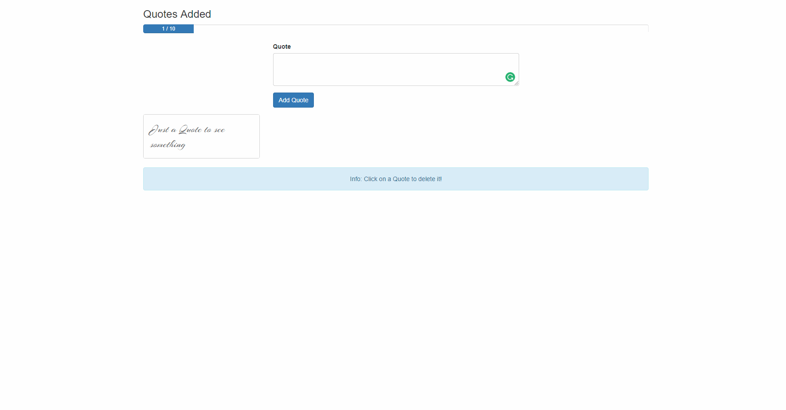

# WEB 2630 Wonderful Quotes
> We have learned a great amount about components and now is time to bring it all together with Project 2. You will be building a quote application. In this application, you will be able to add quotes to your page that is tracked with a progress bar. This progress bar will allow you to add 10 quotes to the page. Once it hits 10 quotes it will warn the user that you need to remove a quote before adding another. In order to remove a quote from your application, you can just select the quote to remove it. To add a quote you will have a text field that you can type the quote into and have a button that you can click to Add the Quote.

## Part 1 Submission

1. Create WEB2630_WonderfulQuotes Repository on GitHub
    * Note: Make Repository Private
2. Open Terminal or Command Prompt
    1. Clone Template
        * git clone --bare https://github.com/CodySquadroni/WEB2630_WonderfulQuotes
            * Note: Make sure to 'cd' to a directory you want it downloaded to.
    2. cd Into WEB2630_WonderfulQuotes.git
    3. Copy Template Into Your Repository
        * git push --mirror https://github.com/GITHUB_USERNAME/WEB2630_WonderfulQuotes
            * Note: Make sure to put your GitHub Username in place of GITHUB_USERNAME
    4. Remove Copy WEB2630_WonderfulQuotes.git
    5. Clone Your GitHub Repository
        * git clone https://github.com/GITHUB_USERNAME/WEB2630_WonderfulQuotes         
3. Start ToDo Comments
    * Located in App.vue, Header.vue, NewQuote.vue, Quote.vue, QuoteGrid.vue
4. Submit Your GitHub URL
    * For Part 1, you just need to have something submitted to show your progress. You will have more time to finish the project for Part 2.

## Part 2 Submission

1. Complete ToDo Comments
    * Located in App.vue, Header.vue, NewQuote.vue, Quote.vue, QuoteGrid.vue
2. Live Host Wonderful Quotes on Netlify
3. Submit Your GitHub and Netlify URL

**Note: Remember to make your GitHub repository private and add me as a collaborator GitHub username: CodySquadroni**

## Final Outcome



# Commands

## Project setup
```
npm install
```

### Compiles and hot-reloads for development
```
npm run serve
```

### Compiles and minifies for production
```
npm run build
```

### Run your tests
```
npm run test
```

### Lints and fixes files
```
npm run lint
```

### Customize configuration
See [Configuration Reference](https://cli.vuejs.org/config/).
